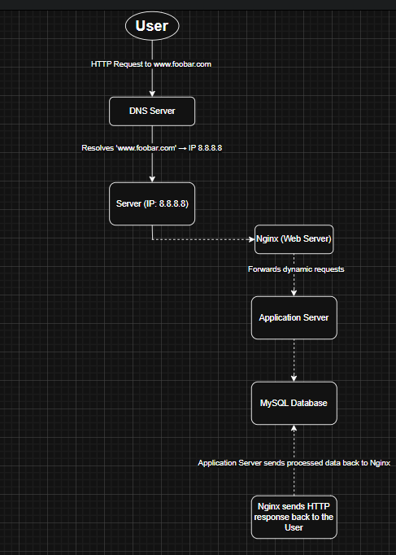

# 0. Simple Web Stack

## Infrastructure Overview
This is a basic web infrastructure to serve a website reachable at `www.foobar.com`. The stack consists of one server running a LAMP-like stack (Linux, Nginx, MySQL, and application code).

### Components
- **Domain Name**: `foobar.com`  
  - DNS record type: `A` record for `www.foobar.com` pointing to IP `8.8.8.8`
- **Server**: `8.8.8.8`
  - **Web Server**: Nginx
  - **Application Server**: Executes dynamic content (e.g., PHP, Node.js)
  - **Application Code**: Custom business logic (HTML, PHP, etc.)
  - **Database**: MySQL

### Flow of a Request
1. User enters `www.foobar.com` in the browser.
2. DNS translates `www.foobar.com` into IP `8.8.8.8`.
3. Browser sends HTTP request to server `8.8.8.8`.
4. Nginx handles the request and passes it to the application server.
5. Application server processes the logic and interacts with MySQL if needed.
6. Response is sent back to the user’s browser.

### Key Concepts Explained

- **Server**: A computer that provides data/services to other computers over a network.
- **Domain Name**: A human-readable address for websites (e.g., foobar.com).
- **DNS Record (A record)**: Maps `www.foobar.com` to the server IP `8.8.8.8`.
- **Web Server (Nginx)**: Handles HTTP requests and serves static content or passes them to the app server.
- **Application Server**: Processes application logic, runs server-side code.
- **Database (MySQL)**: Stores and retrieves structured data for the app.
- **Communication Protocol**: The server and client communicate using **HTTP/HTTPS** over **TCP/IP**.

### Limitations of this Setup

- **Single Point of Failure (SPOF)**: One server — if it goes down, the entire site is offline.
- **Downtime during Maintenance**: Restarting the web/app server for updates causes downtime.
- **No Scalability**: Can’t handle high traffic loads without crashing or slowing down.

---

### Diagram

