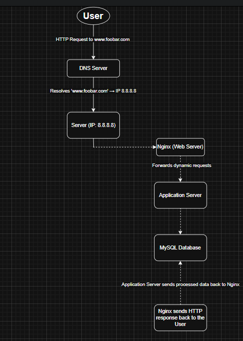

# 1. Distributed Web Infrastructure

## Components
- 1 Load Balancer (HAProxy)
- 2 Servers:
  - Nginx Web Server
  - Application Server
  - Application Files
  - MySQL Database

## Why Each Element is Added
- **HAProxy**: Distributes traffic between servers for better performance and redundancy.
- **Two Web Servers**: Ensures high availability and handles more users.
- **Database Cluster**: Replication ensures data availability even if one DB fails.

## Load Balancer Algorithm
- **Round Robin**: Each request is sent to the next available server in turn.

## Active-Active vs Active-Passive
- The system uses an **Active-Active** setup: both web servers process traffic simultaneously.

## Database: Primary-Replica
- The Primary (Master) handles all write operations.
- The Replica (Slave) handles read operations and syncs data from the Primary.

## Infrastructure Issues
- **SPOF**: Load Balancer is a single point of failure.
- **Security**: No HTTPS or firewall protection.
- **Monitoring**: No system in place to detect failures or intrusions.

## Diagram

