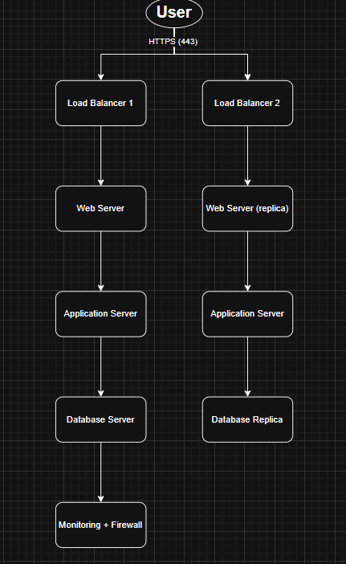

# 3. Scale Up Infrastructure

## New Components
- **1 New Server**: Adds resources to support the split architecture.
- **1 Load Balancer (HAProxy)**: Clustered with the existing one to avoid single point of failure.
- **Split Architecture**:
  - Web Server (Nginx): Handles HTTP and static files
  - Application Server: Runs business logic (e.g., PHP, Node.js)
  - Database Server: Central data storage (MySQL)

## Purpose of Each New Element
- **Load Balancer Cluster**: Provides high availability and load distribution.
- **Dedicated Web Server**: Improves performance and can be scaled separately.
- **Dedicated App Server**: Better CPU/memory resource control and security isolation.
- **Dedicated DB Server**: Centralizes data, allows performance tuning and backup strategies.

## Application Server vs Web Server
- **Web Server** serves static content and proxies requests to the app.
- **Application Server** executes the application logic and communicates with the database.

## Benefits
- **Scalability**: Each layer can be scaled independently.
- **Modularity**: Easier to debug, monitor, and maintain.
- **High Availability**: LB clustering ensures fault tolerance.

## Diagram

